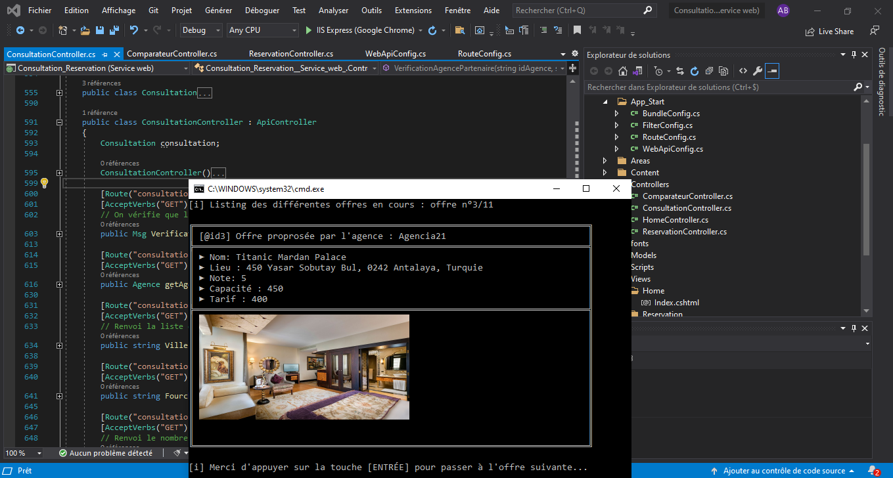
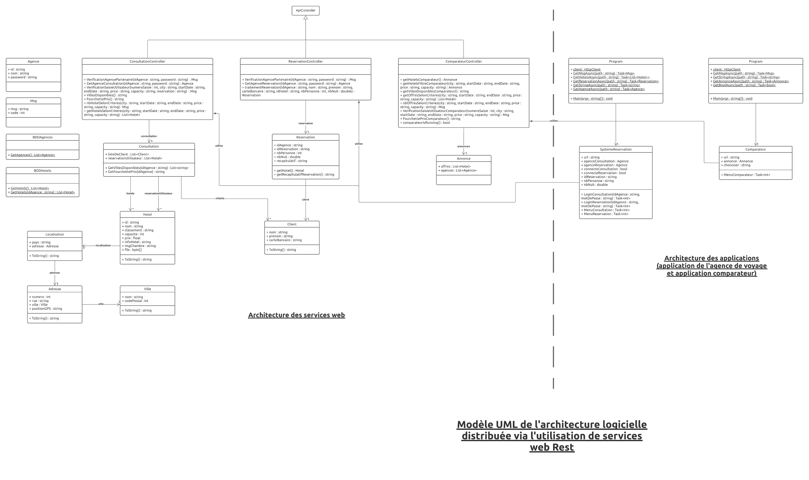
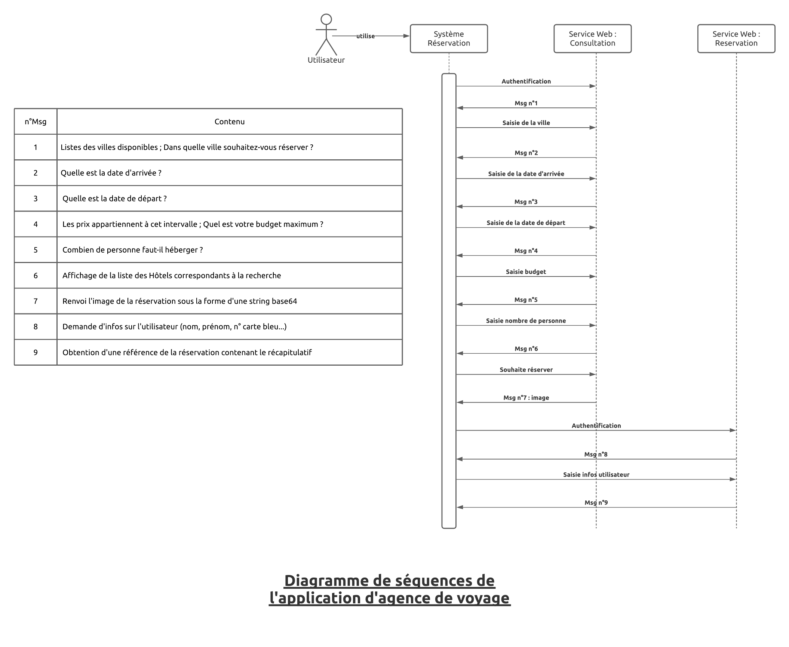
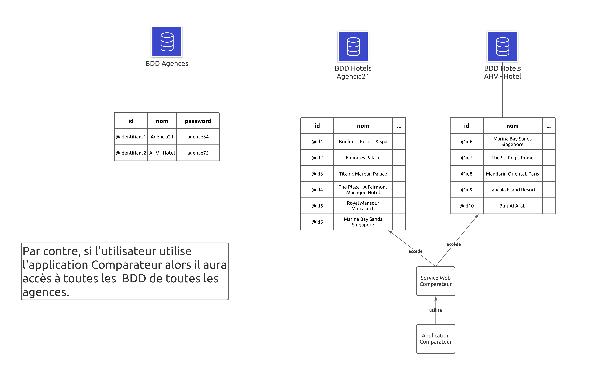

# Création et utilisation de services web

## Screenshots

  
   
   
   

## Description

L'objectif est de réaliser des services en C# et de les faire communiquer à l'aide d'une API Rest. Le context d'utilisation de ces services est celui de la réservation de chambre d'hôtel.
